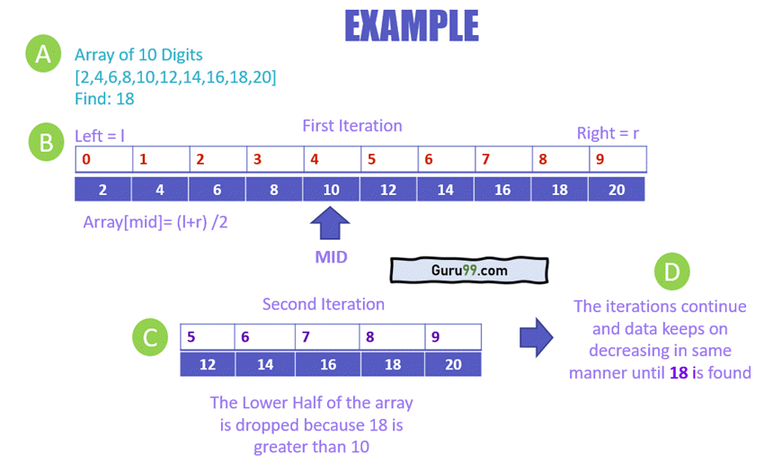

<table id="vocab">

<tr>
<th>Term</th>
<th>Definition</th>
<th>Example</th>
</tr>
  
 <tr> 
  <td> Binary </td>
  <td> number system consisting of 1s and 0s; the primary language used by computers in order to comprehend human logic </td>
   <td>  </td>

  </tr>
  
  <tr>
    <td>Hexadecimal</td>
    <td>an alphanumeric system consisting of number 0-9 and letters a-f; another language used mainly for pictures and RGB</td>
    <td>Ex: Color Codes in HTML and CSS. One hexadecimal digit is equivalent to four binary digits.
    .button:hover { background-color: #f9ece7; color: #44312b; }
       
</td>
  </tr>
  
  <tr>
    <td>Bit</td>
    <td>one unit in a binary sequence; EX. 01 = 2 bits</td>
    <td></td>
  </tr>
  
  <tr>
    <td>Nibble</td>
    <td>4 bits</td>
    <td></td>
  </tr>
  
  <tr>
    <td>Byte</td>
    <td>8 bits; 11111111 = 255</td>
    <td></td>
  </tr>
  
  <tr>
    <td>Computer Network</td>
    <td>interconnected computing devices that can exchange data and share resources with each other</td>
    <td>ex: instant message, or check the weather on your phone, you're using an API
In our code we use data from other sources (API) which interact with each other</td>
  </tr>
  
  <tr>
    <td>Parallel/Distributed computing</td>
    <td>parallel computing on a single computer uses multiple processors to process tasks in parallel; distributed parallel computing uses multiple computing devices to process those tasks</td>
    <td>Ex. Functions in code that can run simultaneously; functions that depend on another before they can run</td>
  </tr>
  
  <tr>
    <td>Protocol</td>
    <td>a set of rules or procedures for transmitting data between electronic devices</td>
    <td>Ex: HTTP or HTTPS</td>
  </tr>
  
   <tr>
    <td>TCP/IP</td>
    <td>a set of rules that mediate the connection of computer systems to the internet/allow systems to communicate across long distances</td>
    <td>disassembled data is sent through a text message and when it reaches its destination, its is reassembled by the other devices TCP protocol</td>
  </tr>
  
   <tr>
    <td>Asynch</td>
    <td>allows code to execute without stopping the rest of the code while it is being run</td>
    <td>when a website is loading, but you can still open a new tab and acesss another website</td>
  </tr>
  
   <tr>
    <td>WEB API</td>
    <td>application programming interface that can be extended through a browser/accessed on the web using http protocol</td>
    <td>Twitter apis allow you to display tweets on a website</td>
  </tr>
  
   <tr>
    <td></td>
    <td></td>
    <td></td>
  </tr>
  
   <tr>
    <td>HTTP</td>
    <td>application-layer protocol for transmitting hypermedia documents; client-server protocol,
requests are created by the receiver - usually the web browser -- both this and secure counterpart: facilitate how  how web servers and browsers should respond to commands.HTTPS </td>
    <td>EX:  appears at the beginning of various URLs or web addresses online/ usually used for transmitting data across internet</td>
  </tr>
  
   <tr>
    <td>GET</td>
    <td>While connected to another computer using an FTP, get is a command line command used to download a file or files from that computer</td>
    <td>usually used in cases when the data does not contain sensitive things; @app.route('/reminders/', methods=['GET'])
def reminders():
    #kdf = open('/tmp/KammyDebug.txt', 'wt+'))

</td>
  </tr>
  
   <tr>
    <td>POST</td>
    <td>Basically is used to send data to update a resource Usually the data contains sensitive information</td>
    <td>@app.route('/reminders/', methods=['POST']) def storeNotes(): #kdf = open('/tmp/KammyDebug.txt', 'wt+')
RUNTIME EXAMPLE:

https://github.com/sarayu-pr11/team-narks/blob/main/main.py#L85

https://github.com/sarayu-pr11/team-narks/blob/main/main.py#L113</td>
  </tr>
  
   <tr>
    <td>Library</td>
    <td>collections of prewritten code that users can use to optimize tasks</td>
    <td>In FIRST competitions, give you JAVA libraries to start coding robot with -- don't have to start from scratch </td>
  </tr>
  
   <tr>
    <td>Dependencies</td>
    <td>An essential functionality needed for a piece of code to work</td>
    <td>https://github.com/sarayu-pr11/team-narks/blob/main/__init__.py#L2</td>
  </tr>
  
   <tr>
    <td>Import</td>
    <td>an import is when one module gains access to the code in another module by the process of importing it</td>
    <td>RUNTIME EXAMPLE: https://github.com/sarayu-pr11/team-narks/blob/7041446bbed0866fac753cc67fe6fbac7f0f1ce7/main.py#L5 Ex. APIs, import modules in python, any python file</td>
  </tr>
  
   <tr>
    <td>CRUD</td>
    <td>Four actions needed to maintain a storage application. Create Read Update Delete; mainly used for databases
</td>
    <td>Ex. crud in our project
      CREATE:
      READ: 
      UPDATE:
      DELETE:

https://github.com/sarayu-pr11/team-narks/tree/main/templates/crud</td>
  </tr>
  
   <tr>
    <td>Sort</td>
    <td>Sorting is used in python lists when a specific item is required</td>
    <td></td>
  </tr>
  
   <tr>
    <td>Linear search</td>
    <td>goes in order from the first to the last index when searching</td>
    <td></td>
  </tr>
  
   <tr>
    <td>Binary searching</td>
    <td>starts in the center and moves outward, works by repeatedly diving the list in half, until you have found the item</td>
     <td> </td>
    <td>
  <tr>
    <td>Metadata</td>
    <td>a set of data that describes and gives information about other data</td>
    <td>Author; Date Created; Date Accessed
     </td>
  </tr>
  
  <tr>
    <td>Fetch</td>
    <td>retrieval of data by a software program, script, or hardware device. After being retrieved, the data is moved to an alternate location or displayed on a screen</td>
    <td> function get_random_dog_image(){

     url = "https://dog.ceo/api/breeds/image/random";

      fetch(url)</td>
  </tr>
  
  <tr>
    <td>Blueprints</td>
    <td>high-level plan or outline used in the development of software. Redirects main.py files, used in better organization for project</td>
    <td>app_crud = Blueprint('crud', name, url_prefix='/crud', template_folder='templates/crud/', static_folder='static', static_url_path='static')</td>
  </tr>
  
  <tr>
    <td>Data</td>
    <td>Any information that is processed/ stored in a computer. Examples: text documents, images, audio clips, software programs, etc.</td>
    <td>ex: images/assets from data folder
</td>
  </tr>
  
  <tr>
    <td>Data Abstraction</td>
    <td>a simplified representation of data so it makes it easier to read and understand</td>
    <td>"/static/assets/note.png" id="img1" onclick="play1()" height="270" width="480">
function play1() { var audio = document.getElementById("audio"); audio.play(); }
</td>
  </tr>
      
 <tr>
    <td>Procedural Abstraction</td>
    <td>When properties of a procedure are separated from it's implementation; makes programs easier to understand.</td>
    <td>onclick="onSubmit();         function onSubmit()

</td>
  </tr>
  
 <tr>
   <td>MVC</td>
   <td>Model-view-controller 
 is a pattern in software design commonly used to implement user interfaces, data, and controlling logic. 
</td>
   <td> </td>
  </tr>

  
  <tr>
    <td>Lossless</td>
    <td>class of data compression algorithms that allows the original data to be perfectly reconstructed from the compressed data. Lossless compression methods are reversible.</td>
    <td>https://github.com/sarayu-pr11/team-narks/blob/main/static/assets/riyapic.png</td>
  </tr>
  
  <tr>
    <td>Lossy</td>
    <td>method of data compression in which the size of the file is reduced by eliminating data in the file.</td>
    <td>https://github.com/sarayu-pr11/team-narks/blob/main/static/assets/flamingo.gif</td>
  </tr>
  
  <tr>
    <td>Function</td>
    <td>self contained" modules of code that accomplish a specific task</td>
    <td>function play2() {
    var audio = document.getElementById("audi");
    audio.play();
}

function play3() {
    var audio = document.getElementById("aud");
    audio.play();
}

function play4() {
    var audio = document.getElementById("au");
    audio.play();
} </td>
  </tr>
      
   <tr>
      <td>Response</td><td>the first computer sends a request for some data and the second responds to the request/ how long it takes for computer to respond to whatever you asked it do</td>
      <td>

url = "https://dog.ceo/api/breeds/image/random";

      fetch(url)
          .then(function(response){
              return response.json();</td>
      </tr>
  
  <tr>
    <td>OOP </td>
    <td>Object Oriented Programming is a programming model that organizes the program around objects rather than functions</td>
 
    
  </tr>
  
  <tr>
    <td>Class </td>
    <td>A class is a blueprint that defines the variables and the methods common to all objects of a certain kind.</td>
    <td>Ex. Vehicles; class="table"; 

        https://github.com/sarayu-pr11/team-narks/blob/43417b0ed0c8c822cf649a15f85a8f2ef233e5d3/templates/flashcards.html#L19</td>
  </tr>
  
  <tr>
        <td>REST</td>
        <td>REST APIs are created withing the interface and accesses a database created by the user and returns response in HTML and JSON data</td>
        <td>JOKES API since it accesses a list of jokes made by the coder</td>
  </tr>    
      
  <tr>
    <td>Attribute </td>
    <td>changeable property or characteristic of some component of a program that can be set to different values.</td>
    <td>Ex: Model of Car, Year it was made, color<a style="background-color: #F9ECD9; color: #A66A7A; font-size: 30px" class="nav-link" href={{ url_for('index') }}>Home</a>

      <tr><td>Object- instance of a class Ex: Cars<td></tr>

      <tr><td>Methods</td><td> in OOP: are like drive and brake function</td></tr>

  </tr>
      
<tr>
  <td>Request</td>
  <td>a message sent between objects</td>
  <td>payload = "{ \"key1\": \"value\",\"key2\": \"value\"}"
headers = {
    'content-type': "application/json",
    'x-rapidapi-host': "motivational-quotes1.p.rapidapi.com",
    'x-rapidapi-key': "066e279e11mshd6855dd2ac40d0dp19761ajsn088d1e5fbc92"
}

response = requests.request("POST", url, data=payload, headers=headers)</td>
      </tr>
  
      

 
